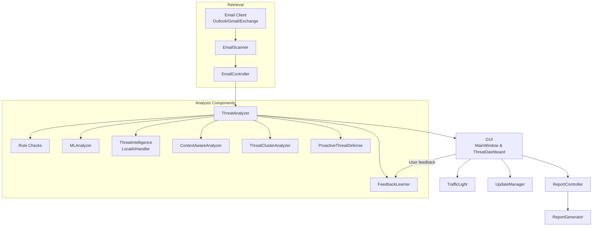

# Mail Analyzer Project Documentation

## Overview
The project provides an extensible platform for scanning emails, evaluating threats through rule-based checks and machine-learning techniques, and presenting the results in a desktop GUI. Configuration and logging are centralized in `config/settings.py` to control scanning limits, threat-level markers, and scoring weights used throughout the analysis pipeline.

### Email Retrieval
`EmailScanner` loads the appropriate mail client (Outlook, Gmail, or Exchange) and fetches messages while applying basic risk checks such as suspicious keywords, links, or attachments. It is wrapped by `EmailController`, which pairs each retrieved email with a detailed analysis.

### Threat Analysis
`ThreatAnalyzer` orchestrates multiple techniques—rule-based heuristics, machine-learning predictions, contextual evaluation, clustering, and trend analysis—to produce a normalized threat score and explanatory indicators. Supporting components include:

- `MLAnalyzer` for a retrainable RandomForest model.
- `ThreatIntelligence` integrating local AI models and external reputation checks.
- `ContextAwareAnalyzer`, `ThreatClusterAnalyzer`, and `ProactiveThreatDefense` for context, clustering, and trend insights respectively.
- `FeedbackLearner` captures user feedback and adjusts future scoring with a GradientBoosting model.
- `LocalAIHandler` coordinates optional Ollama/DeepSeek models to enrich text analysis.

### Reporting and Updates
`ReportGenerator` can output PDF or Excel summaries and compute statistics on analyzed emails. `ReportController` aggregates GUI data for these reports, while `UpdateManager` periodically checks for new software releases.

### GUI
The PyQt6 `MainWindow` drives the application: it schedules email refreshes, displays analyses with color-coded `EmailListItem` widgets, launches the `ThreatDashboard`, and delegates reporting tasks.

## Mermaid Diagram

This diagram summarizes the data flow: emails are collected by `EmailScanner`, analyzed via `ThreatAnalyzer` and its subsystems, presented in the GUI, and optionally exported or used for continuous learning.
