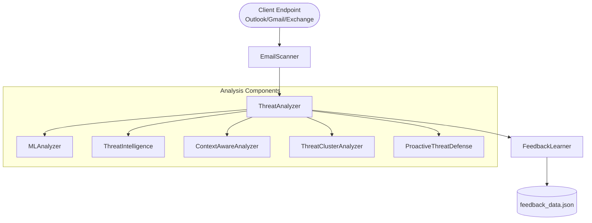

# Request Flow Overview

This document describes how a message moves through the mail analyzer system from the moment it is retrieved from a client endpoint until it is persisted on disk.

## Flow Summary

1. **Email retrieval** – `EmailScanner` loads the configured email client (Outlook, Gmail or Exchange) and downloads messages from the provider.
2. **Threat analysis** – Each message is processed by `ThreatAnalyzer`, which combines rule based checks, machine learning, contextual evaluation, clustering and proactive defence modules to calculate a threat score.
3. **GUI integration** – The main window refresh routine retrieves emails through the scanner and immediately analyzes them so that results can be shown to the user.
4. **Feedback storage** – Optional user feedback is persisted by `FeedbackLearner` to a local JSON file which acts as the project's database.

